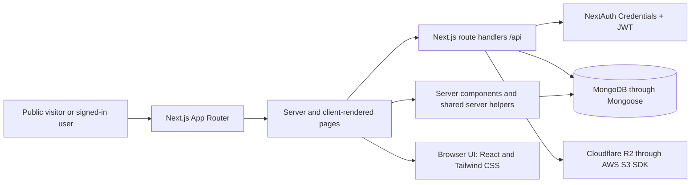
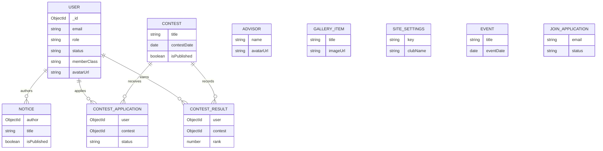

# CPC-CSTU Project Documentation

## 1. Project Overview

**Project name:** CSTU Computer & Programming Club (CPC) website and management platform.

**Purpose:** The application provides the club with a public website for its identity, membership information, notices, events, contests, and gallery, alongside authenticated member and administrator areas.

### Problems it addresses

- Gives students and visitors a central place to learn about the club and apply for membership.
- Lets administrators review applications and manage member records.
- Publishes club updates and activities from database-backed records rather than requiring public-page edits for every notice or event.
- Gives members a private dashboard, profile, contest applications, and a downloadable digital ID-card view.

### Users and features

| Audience | Main capabilities |
|---|---|
| Public visitors | View the homepage, member/advisor directory, gallery, notices, events, and contests; submit a membership application; sign in. |
| Members | Sign in, use the member dashboard, manage their own profile, view contest applications, and access the digital ID card. |
| Administrators | Review membership applications; manage members, advisors, gallery items, notices, events, contests, and site settings. |

The public site and dashboards are part of one Next.js application. The public layout uses a compact navigation; admin and member pages use a role-aware dashboard sidebar. The homepage is intentionally limited to the club brand, hero text, calls to action, and statistics rather than becoming a list of every site feature.

### High-level architecture



There is no separately deployed API service in the inspected source. Backend endpoints are Next.js route handlers under `src/app/api/`; some public pages instead query Mongoose directly in server components.

## 2. Technologies Used

Versions below are those declared in `package.json`; this does not imply that every package has a direct use in application source.

| Technology | Purpose in this project | Where it is used |
|---|---|---|
| Next.js `16.3.8` | App Router pages, layouts, server rendering, and HTTP route handlers. | `src/app/`, `src/proxy.js`, `next.config.mjs`; commands in `package.json`. |
| React / React DOM `19.2.8` | Page and reusable UI components, including interactive client components. | `.js` pages and components throughout `src/app/` and `src/components/`. |
| JavaScript (ES modules) | Application language. The app source is JavaScript, not TypeScript. | `src/**/*.js`, `scripts/**/*.js`, and `.mjs` configuration files. |
| Tailwind CSS `4` | Utility-based responsive styling. | `src/app/globals.css` imports Tailwind; `postcss.config.mjs` registers `@tailwindcss/postcss`; pages use utility classes. |
| `lucide-react` | Icons in navigation, forms, cards, and dashboard pages. | `src/components/` and page files under `src/app/`. |
| MongoDB and Mongoose `9.9.2` | Persistent document database and schema/model layer. | Models in `src/models/`; connection and cached connection handling in `src/lib/db.js`; APIs and server pages call the models. |
| NextAuth `4.24.15` | Credentials sign-in, JWT sessions, and session/token access in pages and APIs. | `src/lib/auth.js`, `src/proxy.js`, `src/components/Providers.js`, `src/app/api/auth/[...nextauth]/route.js`, and protected route handlers. |
| `bcryptjs` | Hashes passwords and compares submitted passwords at login. | `src/lib/auth.js`, membership application and admin/member APIs, and `scripts/seed-admin.js`. |
| AWS SDK S3 client | S3-compatible object operations against Cloudflare R2 for uploaded files. | `src/lib/r2.js` uses `@aws-sdk/client-s3`; `src/app/api/upload/route.js` invokes it. |
| `qrcode.react` | Renders the QR code in the member ID card. | `src/components/IDCard.js`. |
| `html2canvas-pro` and `jspdf` | Capture the digital ID card and create a PDF download. | `src/app/(member)/member/credential/page.js`. |
| `next/font/google` fonts | Loads Inter and Outfit font variables in the root layout. | `src/app/layout.js`; body text styling uses the Inter variable in `src/app/globals.css`. |
| Node.js scripts | Seed an administrator and migrate existing member-class/static CMS content. | `scripts/`; commands are declared in `package.json`. |

**Form validation note:** Forms currently use local React state and explicit checks in the page/API code, plus Mongoose schema validation. Although `zod`, `react-hook-form`, and `@hookform/resolvers` are listed in `package.json`, no direct imports of those packages were found in `src/`; they are not the validation mechanism currently used by the inspected forms.

## 3. Important Project Structure

The project root is the directory containing `package.json`. The following are the application files most useful for understanding or presenting the implementation.

```text
src/
  app/
    (public)/                 Public website routes and shared public layout
    (admin)/admin/             Administrator pages
    (member)/member/           Member portal pages
    api/                       Next.js API route handlers
    globals.css                Global Tailwind import and base colors/fonts
    layout.js                  Root HTML layout and session provider
  components/                  Shared navigation, upload, gallery, ID-card UI
  data/                        Legacy advisor/gallery migration source data
  lib/                         Database, auth, R2, site settings, helpers
  models/                      Mongoose schemas/models
  proxy.js                     Role checks and redirects for protected pages
scripts/                       Seed and data migration scripts
public/                        Static assets, including existing gallery images
```

### Key files

| Relative path | Responsibility and connections |
|---|---|
| `src/app/layout.js` | Root document layout, global CSS, Inter/Outfit font variables, and `Providers` session context. |
| `src/app/globals.css` | Tailwind CSS import and base page colors/font. Most detailed presentation is implemented through Tailwind classes in the components/pages. |
| `src/app/(public)/layout.js` | Loads site settings and wraps public pages with `Navbar` and `PublicFooter`. |
| `src/app/(public)/page.js` | Homepage server component; queries the live active-member count and site settings, then renders hero, calls to action, and statistic cards. |
| `src/app/(admin)/admin/layout.js` | Shared admin page shell using the sidebar and responsive main content. |
| `src/app/(member)/member/layout.js` | Shared member page shell using the role-aware sidebar. |
| `src/components/Navbar.js` | Public navigation, settings-driven club brand/tagline, responsive mobile menu, and sign-in/dashboard controls. |
| `src/components/PublicFooter.js` | Settings-driven club name, contact email, Facebook link, university club-page link, and copyright text. |
| `src/components/Sidebar.js` | Admin/member-specific dashboard navigation based on the current session role. |
| `src/components/Providers.js` | Wraps the application in NextAuth's `SessionProvider` for client-side session access. |
| `src/components/FileUpload.js` | Shared file picker, preview, replacement/removal controls, client-side checks, and upload request. |
| `src/components/GalleryCard.js` | Reusable card used to show a gallery item's image and description. |
| `src/components/IDCard.js` | Member card rendering, QR code payload, avatar preview, and card content. |
| `src/proxy.js` | Redirects unauthenticated visitors from `/admin` and `/member`; checks the ADMIN role on `/admin`; redirects signed-in users away from `/login`. |
| `src/lib/auth.js` | NextAuth Credentials provider, database-backed identity lookup, bcrypt password comparison, and JWT/session callbacks. |
| `src/lib/adminAuth.js` | Shared server-side check used by some admin APIs; resolves token/session role. |
| `src/lib/db.js` | Connects to MongoDB using `MONGODB_URL` or `MONGODB_URI` and caches the connection. |
| `src/lib/r2.js` | Configures the Cloudflare R2 S3 client, uploads objects, and performs constrained cleanup of managed upload URLs. |
| `src/lib/siteSettings.js` | Default club/site values and `getSiteSettings()`, which overlays stored settings on defaults. |
| `src/lib/memberClasses.js` and `src/lib/designations.js` | Member-class labels and executive designation ordering/recognition. |
| `src/models/` | Mongoose schemas for users, membership applications, advisors, gallery items, site settings, notices, events, contests, contest applications, and results. |
| `src/data/advisors.js` and `src/data/gallery.json` | Legacy records consumed by the static-to-database migration, not the live public CMS data source. |
| `scripts/migrate-static-cms-content.js` | Idempotently inserts legacy advisor/gallery entries that do not already exist by matching names/titles. |
| `scripts/migrate-member-classes.js` | Existing migration command for member-class data. |
| `scripts/seed-admin.js` | Creates or updates an admin account using environment configuration and bcrypt. Review its development fallback/logging behavior before running in a real deployment. |
| `package.json` | Dependency declarations and development/build/start/lint/seed/migration commands. |
| `next.config.mjs`, `postcss.config.mjs`, `eslint.config.mjs`, `jsconfig.json` | Next configuration, Tailwind PostCSS plugin, ESLint configuration, and `@/*` alias resolution. |

The project root also contains `README.md` and `documentation.md`; this file is a separate technical guide and does not replace either file.

## 4. Homepage Implementation

The homepage is rendered by `src/app/(public)/page.js`. Its layout and decorative elements are code; editable copy, calls to action, and statistic definitions come from the site-settings record/defaults.

| Section | Purpose and implementation | Content source and styling |
|---|---|---|
| University label | Identifies the university above the main heading. | Text is currently static JSX in `src/app/(public)/page.js`; styled with Tailwind badge, border, icon, and background utilities. |
| Hero heading | Presents the club's short identity message. | `heroTitle` from `getSiteSettings()`; heading is split at ` • ` and the final part receives a gradient text style. |
| Description | Briefly explains the club. | `heroSubtitle`, falling back to `clubDescription`, from site settings. |
| Membership and constitution actions | Links to the membership form and constitution. | CTA labels/URLs come from site settings; rendered as a Next.js `Link` and external anchor. |
| Statistics | Gives a concise snapshot of club activity. | Array in `SiteSettings.statistics`, or defaults in `src/lib/siteSettings.js`. A statistic marked `usesMemberCount` is populated from a live `User.countDocuments({ status: "ACTIVE", role: "MEMBER" })` query. |
| Header and footer | Supplies navigation and club contact links around the page. | `src/app/(public)/layout.js` loads settings and passes them to `Navbar` and `PublicFooter`. |

The hero backgrounds, grid, card layout, colors, breakpoints, and icon mapping remain presentational code in `src/app/(public)/page.js`; they are not database-driven. The homepage does not render separate homepage sections for the gallery, advisors, notices, events, or contests.

## 5. Admin Dashboard and Authentication

### Sign-in flow

1. The login UI is at `/login` (`src/app/(public)/login/page.js`). It calls `signIn("credentials", { redirect: false, email, password })`.
2. The NextAuth Credentials provider in `src/lib/auth.js` loads a `User` by normalized email, rejects missing/inactive accounts, and uses `bcrypt.compare` to check the submitted password.
3. Successful identity data is added to a JWT by the NextAuth callbacks. The session callback exposes fields needed by the UI, including ID, role, designation, and avatar URL.
4. The login page reads `/api/auth/session` and routes ADMIN users to `/admin/dashboard`; other signed-in users go to `/member/dashboard`.
5. `src/components/Providers.js` supplies client components such as the navbar and sidebar with NextAuth session state.

The NextAuth handler is exposed at `/api/auth/[...nextauth]` in `src/app/api/auth/[...nextauth]/route.js`. The session strategy in `src/lib/auth.js` is JWT; the code does not describe a separate session database.

### Protected routes and admin API access

- `src/proxy.js` checks the NextAuth JWT for `/admin/:path*` and `/member/:path*`. Unauthenticated requests are redirected to `/login` with a callback path. Non-admin users are redirected away from `/admin`.
- Admin and member layouts (`src/app/(admin)/admin/layout.js`, `src/app/(member)/member/layout.js`) provide page structure; they are not substitutes for authorization.
- Admin API handlers perform server-side role checks, either via `isAdminRequest()` in `src/lib/adminAuth.js` or by resolving the NextAuth token/session inside the handler. Unauthenticated/unauthorized API requests receive JSON error responses and appropriate 401/403 statuses where implemented.
- The sidebar in `src/components/Sidebar.js` selects admin links or member links from `session.user.role`.

### Dashboard and form-to-API behavior

`src/app/(admin)/admin/dashboard/page.js` fetches `/api/admin/dashboard` and displays counts and recent applications/notices. The endpoint requires ADMIN and queries MongoDB models.

CMS screens under `src/app/(admin)/admin/` are client components. Their forms generally keep input in React state, send JSON with `fetch()` to the matching `/api/admin/...` route, and update/reload client-side data from the response. Server handlers check permissions, validate required values and dates/IDs where implemented, then call Mongoose create/update/delete operations. Mongoose enums, required fields, and `runValidators` in some update routes provide additional validation. This is hand-written validation, not a project-wide Zod schema layer.

After an admin save, public pages query MongoDB directly or fetch a public API with `cache: "no-store"`; relevant server pages/routes are marked `force-dynamic`. Therefore the public UI reads current database-backed content on the next request rather than depending on a new build.

## 6. Dynamic Content Management

Status definitions: **Implemented** means the admin/public data path is present in source; it does not mean every authenticated end-to-end workflow was independently exercised in the documentation task. **Partially implemented** means some content remains static or an operational step is still needed.

| Feature and status | Admin interface / API | Public display / data source | CRUD, upload, and implementation notes |
|---|---|---|---|
| **Executive members — Implemented** | `src/app/(admin)/admin/members/page.js`; `/api/admin/members` and `/api/admin/members/[id]`. | `src/app/(public)/members/page.js`; `/api/public/members`. Uses the existing `User` model, not a second executive model. | Admin can create/edit/delete user records and manage `memberClass`, designation, profile visibility, display order, and profile fields. Public directory filters visible active member accounts and identifies executives using `memberClass` and designation helpers. Account `role`/`status` remain distinct from public profile visibility. Profile photos use `avatarUrl` and the shared upload path. |
| **Advisors — Implemented** | `src/app/(admin)/admin/advisors/page.js`; `/api/admin/advisors` and `/api/admin/advisors/[id]`. | The Advisors tab in `src/app/(public)/members/page.js` loads `/api/public/advisors`; a standalone advisor display also exists at `src/app/(public)/advisor/page.js` (and an `/advisors` route file exists). Data is from `Advisor`. | Create/list/update/delete, ordering, active/published flags, profile fields and avatar URL are represented. The public API returns active and published advisors. Photo upload uses `FileUpload` and R2. If an advisor has no image URL, the public card displays initials; portraits must be uploaded by an administrator. |
| **Gallery — Implemented** | `src/app/(admin)/admin/gallery/page.js`; `/api/admin/gallery` and `/api/admin/gallery/[id]`. | `src/app/(public)/gallery/page.js` calls `/api/public/gallery` and renders `GalleryCard` (`src/components/GalleryCard.js`). | Admin CRUD covers title, description, image URL, category, display order, and publication state. The public API returns published entries. Upload uses R2. The migration imports existing `src/data/gallery.json` entries and verifies the corresponding `public/` images; those historical image URLs remain local asset paths rather than R2 uploads. |
| **Notices — Implemented** | `src/app/(admin)/admin/notices/page.js`; `/api/admin/notices` and `/api/admin/notices/[id]`. | `src/app/(public)/notices/page.js` queries `Notice` directly; public API routes are `/api/public/notices` and `/api/public/notices/[id]`. | Admin create/read/update/delete includes title/content/category, date, pinned/published state, optional external link, and optional attachment. `author` references a `User`. Attachments may be PDFs and use the shared R2 uploader. Public listing excludes unpublished items and sorts pinned/date-first. |
| **Events — Implemented** | `src/app/(admin)/admin/events/page.js`; `/api/admin/events` and `/api/admin/events/[id]`. | `src/app/(public)/events/page.js` queries `Event` directly; `/api/public/events` and `/api/public/events/[id]` also exist. | Admin CRUD covers title, description, venue/date, status, registration URL, cover image, active/published, and featured flags. Public listing requires active and published and sorts featured/date. Cover image uploads use R2. |
| **Contests — Implemented** | `src/app/(admin)/admin/contests/page.js`; `/api/admin/contests` and `/api/admin/contests/[id]`. Applications/results use `/api/admin/contests/[id]/applications` and `/api/admin/contests/[id]/results`. | `src/app/(public)/contests/page.js` queries published contests and standings. Public routes include `/api/public/contests`, `/api/public/contests/[id]`, and `/api/public/contests/[id]/results`. | Admin CRUD covers dates, platform and contest/registration/result links, status, featured, and publication flags. Results are entered/updated against a contest and member; member contest applications use `/api/member/contests/[id]/apply`. The public leaderboard is restricted to result records belonging to published contests. |
| **Homepage content/statistics — Implemented, with static layout** | `src/app/(admin)/admin/site-settings/page.js`; `/api/admin/settings` GET/PUT. | `src/app/(public)/page.js` calls `getSiteSettings()`; `src/lib/siteSettings.js` merges database values with defaults. | Admin-editable fields include hero text, CTA labels/URLs, club description, and statistics. The active-member statistic can be computed live from `User`; the other statistic values are editable strings. Visual structure, section copy outside settings, and decoration remain code. |
| **Club/contact settings — Implemented** | Same Site Settings page/API and `SiteSettings` model. | Public header/footer consume settings through `src/app/(public)/layout.js`, `src/components/Navbar.js`, and `src/components/PublicFooter.js`. | Club name/tagline, email, Facebook URL, official university club URL, constitution URL, and footer copyright are stored centrally with defaults in `src/lib/siteSettings.js`. The same settings include homepage fields. |
| **Membership application — Implemented** | Public form at `src/app/(public)/join/page.js`; admin review at `src/app/(admin)/admin/applications/page.js`; `/api/public/join`, `/api/admin/applications`, `/api/admin/applications/[id]`. | Successful admin approval creates or updates a `User`, which can then appear in member listings according to visibility/status. | Applicants submit student/profile/payment-transaction fields and a password. The public API checks required values, minimum password length and duplicates, hashes the password, and stores a pending `JoinApplication`. Admin approval promotes or updates the associated `User`; the application has a status and remarks. |
| **Member self-service — Implemented** | `src/app/(member)/member/` pages and `/api/member/...` handlers. | Private dashboard, profile editor, contest applications, and digital credential pages. | Members update permitted profile fields through `/api/member/profile/[id]`; the handler permits the member's own ID or an ADMIN and reserves role/status changes for ADMIN. |

### Dynamic versus static content

- Database-backed: member/executive profiles, advisor records, gallery entries, notices, events, contests, contest applications/results, join applications, and site settings.
- Defaulted but editable content: `src/lib/siteSettings.js` supplies defaults when the singleton settings document is absent; default copy/statistics are not evidence that corresponding database values were seeded.
- Static presentation: page headings/instructions, card structure, colors, layout, footer arrangement, and the homepage university label remain source-controlled.
- Legacy migration sources: `src/data/advisors.js` and `src/data/gallery.json` are used by `scripts/migrate-static-cms-content.js`; the live public pages read database/API content rather than those files directly.

## 7. Database and Data Flow

### Database and models

The project uses MongoDB accessed through Mongoose. `src/lib/db.js` chooses `MONGODB_URL` first and falls back to `MONGODB_URI`, then caches the connection on the Node.js global object to avoid repeatedly opening connections in a running process.

| Model (`src/models/`) | Main fields and role |
|---|---|
| `User.js` — `User` | Identity, email/password hash, `role` (`ADMIN`/`MEMBER`), `status` (`ACTIVE`/`INACTIVE`), member class, student ID, department/session, designation, bio, display order, public-profile visibility, avatar, contact/profile handles. |
| `JoinApplication.js` — `JoinApplication` | Submitted student/profile/payment reference details, password hash, pending/approved/rejected status, remarks. Approval creates or updates a `User`; the schema does not use a foreign-key relation to that user. |
| `Advisor.js` — `Advisor` | Name, title/designation, department/institution, bio/contact/social links, avatar, order, active and published flags. |
| `GalleryItem.js` — `GalleryItem` | Title, description, image URL, category, order, publication flag. |
| `SiteSettings.js` — `SiteSettings` | Singleton-like record identified by unique `key` (normally `main`); branding, contact/social/official links, homepage hero/CTA fields, statistics, timestamps. |
| `Notice.js` — `Notice` | Title/content/category, pinned/published flags, notice date, attachment/external URLs, `author` reference to `User`. |
| `Event.js` — `Event` | Title/description/venue/date, cover image, registration link, status, active/published/featured flags. |
| `Contest.js` — `Contest` | Title/description/platform, contest/registration/result links and dates, status, publication/featured flags. |
| `ContestApplication.js` — `ContestApplication` | `contest` reference to `Contest`, `user` reference to `User`, team fields, application status, remarks. |
| `ContestResult.js` — `ContestResult` | `contest` reference to `Contest`, `user` reference to `User`, solved count, rating, rank, remarks. |

### Relationships



The diagram reflects explicit Mongoose references present in the models. Advisors, gallery items, events, settings, and join applications have no declared model relationship to `User` or one another. No separate `ExecutiveMember` model exists; executive status is represented in the existing User record.

### Example: changing an advisor profile

1. An administrator edits the advisor form in `src/app/(admin)/admin/advisors/page.js`.
2. If a new portrait is selected, `src/components/FileUpload.js` sends it as multipart form data to `POST /api/upload`.
3. The upload route checks for a signed-in session, accepted MIME type, and file size, then `src/lib/r2.js` writes the object to Cloudflare R2 and returns a public URL.
4. The advisor form submits the profile fields, including that URL, to `POST /api/admin/advisors` (or `PUT /api/admin/advisors/[id]` when editing).
5. The handler checks ADMIN authorization, validates required name/ID values, and creates or updates a Mongoose `Advisor` document in MongoDB.
6. The next public directory request calls `/api/public/advisors`, which selects active and published advisor documents; the public page renders the card and image URL.

Other CRUD forms use the same broad React form → authenticated Next.js API handler → Mongoose → public query pattern. The homepage has an additional live count query and may use default site settings when no settings record exists.

## 8. Image Upload and Storage

### Upload path

- **Interface:** `src/components/FileUpload.js` is reused in member, advisor, gallery, event, and notice forms. It previews images; PDFs are shown as a link; the user can replace or remove the current URL in the form.
- **Client checks:** permitted MIME selection and non-empty size limits are checked before sending the request.
- **Server endpoint:** `POST /api/upload` in `src/app/api/upload/route.js` requires a NextAuth session, accepts JPEG, PNG, WEBP, GIF, AVIF, and PDF types, and limits images to 10 MB and PDFs to 15 MB.
- **Storage:** `src/lib/r2.js` uses the AWS S3 client pointed at Cloudflare R2. New objects are written below an `uploads/` key prefix and the endpoint returns a URL based on `R2_PUBLIC_URL`.
- **Persistence:** The content document stores a URL (for example `User.avatarUrl`, `Advisor.avatarUrl`, `GalleryItem.imageUrl`, `Event.coverImage`, or `Notice.attachmentUrl`); the binary is stored in the configured R2 bucket rather than React state or local browser storage.
- **Replacement/deletion:** Relevant record APIs attempt to delete the previous R2 object when a managed URL is replaced or its record is deleted. Cleanup is limited to URLs beneath the configured public base's `/uploads/` path. Cleanup errors are logged and returned as a warning because the database operation may already have completed.

**Operational limitations:** Uploads require `R2_ACCOUNT_ID`, `R2_ACCESS_KEY_ID`, `R2_SECRET_ACCESS_KEY`, `R2_BUCKET` (the code has a default bucket name), and `R2_PUBLIC_URL` to be configured correctly. The endpoint requires any signed-in session, not specifically the ADMIN role; the CMS record mutation endpoints separately require ADMIN. Server validation is based on the uploaded file's MIME type and size; the inspected code does not scan file contents. The actual production R2 credentials, public URL configuration, bucket policy, and persistence after a real deployment cannot be confirmed from source.

Historical gallery entries use local `/img/...` paths under `public/` and are not R2 objects. Advisors without a confirmed image remain supported by an initials fallback; they need administrator-supplied portraits for actual photos.

## 9. API and Routing Reference

`(public)`, `(admin)`, and `(member)` are Next.js route groups and are omitted from the visible URL. Dynamic `[id]` segments are MongoDB record IDs unless otherwise handled. The table lists the route handlers found in `src/app/api/`.

### Authentication, membership, and profile APIs

| Method | Endpoint | Purpose and data | Access |
|---|---|---|---|
| GET, POST | `/api/auth/[...nextauth]` | NextAuth sign-in/session callbacks. | NextAuth credentials/session behavior. |
| POST | `/api/public/join` | Validate and save a pending membership application; password is hashed before saving. | Public. |
| GET | `/api/admin/applications` | List membership applications for review. | ADMIN. |
| PUT, DELETE | `/api/admin/applications/[id]` | Change application status/remarks, promote/update a user on approval, or delete an application. | ADMIN. |
| GET, POST | `/api/admin/members` | List/create user and member records. | ADMIN. |
| GET, PUT, DELETE | `/api/admin/members/[id]` | Read/update/delete member record; password changes are hashed and account status/role controls are restricted. | ADMIN. |
| GET | `/api/public/members` | Member directory data; query supports role/status/search and response excludes the password field. | Public. |
| GET, PUT | `/api/member/profile/[id]` | Read profile data and update permitted own-profile fields (ADMIN can update another profile). | GET is not session-guarded in the inspected handler; PUT requires the owner or ADMIN. |
| GET | `/api/member/dashboard` | Member dashboard data. | Signed-in member, according to route check. |
| GET | `/api/member/applications` | Contest application records for the signed-in member. | Signed-in member. |
| POST | `/api/member/contests/[id]/apply` | Submit a member contest application. | Signed-in member. |

### CMS administration and public content APIs

| Method | Endpoint | Purpose and data | Access |
|---|---|---|---|
| GET | `/api/admin/dashboard` | Dashboard counts and recent applications/notices. | ADMIN. |
| GET, POST | `/api/admin/advisors` | List/create advisor documents. | ADMIN. |
| PUT, DELETE | `/api/admin/advisors/[id]` | Update/delete advisor; clean up replaced/deleted managed R2 portrait. | ADMIN. |
| GET, POST | `/api/admin/gallery` | List/create gallery entries. | ADMIN. |
| PUT, DELETE | `/api/admin/gallery/[id]` | Update/delete gallery item and managed R2 image. | ADMIN. |
| GET, POST | `/api/admin/notices` | List/create notices; creation associates the current admin as author. | ADMIN. |
| GET, PUT, DELETE | `/api/admin/notices/[id]` | Read/update/delete notice and manage its attachment URL. | ADMIN. |
| GET, POST | `/api/admin/events` | List/create event records. | ADMIN. |
| GET, PUT, DELETE | `/api/admin/events/[id]` | Read/update/delete event and cover image. | ADMIN. |
| GET, POST | `/api/admin/contests` | List/create contests. | ADMIN. |
| GET, PUT, DELETE | `/api/admin/contests/[id]` | Read/update/delete contest. | ADMIN. |
| GET, PATCH, PUT | `/api/admin/contests/[id]/applications` | List and change contest application decisions/status. | ADMIN. |
| GET, POST | `/api/admin/contests/[id]/results` | List and create/update standings entries. | ADMIN. |
| GET, PUT | `/api/admin/settings` | Read/save centralized site settings. | ADMIN. |
| GET | `/api/public/settings` | Public settings used by shared branding/contact UI. | Public. |
| GET | `/api/public/advisors` | Active and published advisor profiles. | Public. |
| GET | `/api/public/gallery` | Published gallery entries. | Public. |
| GET | `/api/public/notices` | Published notices and author summary. | Public. |
| GET | `/api/public/notices/[id]` | One published notice. | Public. |
| GET | `/api/public/events` | Active and published events. | Public. |
| GET | `/api/public/events/[id]` | One active and published event. | Public. |
| GET | `/api/public/contests` | Published contests. | Public. |
| GET | `/api/public/contests/[id]` | One published contest. | Public. |
| GET | `/api/public/contests/[id]/results` | Results only when the associated contest is published. | Public. |
| POST | `/api/upload` | Upload an accepted image/PDF to R2 and return its URL. | Requires a signed-in session; not ADMIN-only. |
| GET | `/api/image-proxy` | Fetches a supplied image URL and returns a data URL for ID-card rendering. | No authentication check found in the handler. |

### Page routes

| Visible route | Purpose |
|---|---|
| `/` | Homepage. |
| `/join`, `/login` | Membership application and sign-in. |
| `/members`, `/advisor`, `/advisors` | Member/executive directory and advisor views. |
| `/gallery`, `/notices`, `/events`, `/contests` | Public content pages. |
| `/admin/dashboard`, `/admin/applications`, `/admin/members`, `/admin/advisors`, `/admin/gallery`, `/admin/notices`, `/admin/events`, `/admin/contests`, `/admin/site-settings` | Admin control pages. |
| `/member/dashboard`, `/member/profile`, `/member/credential`, `/member/applications` | Member self-service pages. |

## 10. Security and Error Handling

### Implemented controls

- NextAuth Credentials authentication checks account status and compares submitted passwords with bcrypt hashes (`src/lib/auth.js`).
- New membership applications and password changes use bcrypt hashing in the relevant API handlers.
- JWT/session callbacks carry the user role; `src/proxy.js` uses the role to protect admin page navigation.
- Admin mutation/read handlers check for ADMIN authorization. User-facing APIs return JSON error messages and commonly use 400, 401, 403, 404, or 500 responses.
- Public directory queries exclude the password field; admin member GET/update responses also remove it where implemented.
- Upload endpoint restricts accepted MIME types and file sizes. R2 cleanup only targets URLs under the configured public upload prefix.
- User-supplied content is stored through Mongoose schemas with required fields and enum constraints; some update operations enable Mongoose validators.
- External links rendered in public pages generally use `target="_blank"` with `rel="noopener noreferrer"`.

### Important review points and limitations visible in source

- **Public member-data minimization:** `/api/public/members` queries user documents and excludes only `password`; other fields such as email, phone, and student ID may be returned even if the directory UI does not display them. Its role/status filters are also caller-provided. Restrict filters and return an explicit public-field allowlist before treating this endpoint as privacy-hardened.
- **Image-proxy URL validation:** `/api/image-proxy` fetches the caller-supplied URL server-side and does not show a host allowlist, response-size limit, or strict image-content validation. This should receive a security review to prevent unsafe server-side requests and oversized responses.
- **Upload authorization scope:** `/api/upload` accepts any signed-in session rather than ADMIN-only. This supports signed-in member profile image uploads, but means upload permission is broader than the admin CMS permission boundary.
- **File-content checking:** upload restrictions use the reported MIME type and file size; no content scanner or byte-signature validation is present in the inspected handler.
- **Rate limiting:** no rate-limiting layer was found in the inspected application route handlers.
- **Seed script:** `scripts/seed-admin.js` contains fallback development credentials and prints credential information. Do not use its fallback in a deployed environment; configure a strong `ADMIN_EMAIL` and `ADMIN_PASSWORD`, restrict access to logs, and consider changing the script's behavior before production use.
- **Secrets:** required secret values belong in environment configuration and must not be committed or copied into documentation. `.env` exists locally, but its values are intentionally not read or documented here.
- **Errors:** API handlers generally return JSON errors; some use logged generic messages while others return `error.message`. R2 cleanup failures are reported as warnings after the saved record change instead of pretending the storage cleanup succeeded.

These are source-review observations, not the result of a formal penetration test.

## 11. UI, Reusable Components, and Responsiveness

- **Brand and navigation:** `src/components/Navbar.js` uses the settings-fed name/tagline, compact Home/Join/Executive Members links, a mobile drawer, and role-aware dashboard/sign-out links.
- **Dashboard navigation:** `src/components/Sidebar.js` selects admin or member link sets from the NextAuth session and includes a mobile menu.
- **Profile cards:** `src/app/(public)/members/page.js` presents executive/member records and an Advisors tab; `src/app/(public)/advisor/page.js` shows advisor cards. Advisor initials are a fallback only when `avatarUrl` is empty.
- **Gallery cards/lightbox:** `src/components/GalleryCard.js` displays each item; the page at `src/app/(public)/gallery/page.js` owns the responsive grid and detail modal.
- **Upload control:** `src/components/FileUpload.js` is shared by multiple admin forms, reducing upload UI duplication.
- **Digital ID:** `src/components/IDCard.js` renders the member card and QR code; the credential page uses the HTML-to-canvas/PDF packages for download.
- **Styling:** Tailwind classes provide colors, borders, spacing, hover states, responsive columns, and breakpoint behavior. `src/app/globals.css` imports Tailwind CSS 4 and defines basic page colors/font.
- **Responsive behavior:** The code uses responsive utility prefixes such as `sm:`, `md:`, and `lg:`, grid changes, overflow wrappers for tables, and mobile nav/sidebar controls. This describes the implementation approach; no formal multi-device visual/accessibility test was performed for this documentation.
- **Accessibility evidence:** Many image elements include alternative text; forms use labels and display validation/error text; some errors use `role="alert"` and member modals handle Escape. A formal WCAG/accessibility audit is not present.

## 12. Deployment and Configuration

### Commands from `package.json`

```bash
npm run dev
npm run build
npm run start
npm run lint
npm run seed:admin
npm run migrate:member-classes
npm run migrate:static-cms-content
```

`npm run seed` is an alias for the admin seed script. `npm run start` runs the Next.js production server and expects a completed production build.

### Environment variable names found in source

| Variable | Use |
|---|---|
| `MONGODB_URL` | Primary MongoDB connection variable in `src/lib/db.js`. |
| `MONGODB_URI` | Fallback MongoDB connection name; also accepted by scripts. |
| `NEXTAUTH_SECRET` | Signs/verifies NextAuth JWT/session tokens. |
| `R2_ACCOUNT_ID` | Cloudflare account identifier used to construct the R2 endpoint. |
| `R2_ACCESS_KEY_ID`, `R2_SECRET_ACCESS_KEY` | R2 S3-compatible credentials. |
| `R2_BUCKET` | Target object bucket; code has a default if absent. |
| `R2_PUBLIC_URL` | Public URL base used to return uploaded file URLs and identify managed objects for cleanup. |
| `ADMIN_EMAIL`, `ADMIN_PASSWORD` | Optional admin seed input; configure explicit strong values rather than using script fallbacks. |

The static CMS migration script also falls back to a local MongoDB URL when no database variable is set. Do not run migrations against a production database without first checking the target connection and taking an appropriate backup.

### Deployment platform

The inspected root configuration includes Next.js, PostCSS, ESLint, and import-alias configuration, but no deployment provider configuration was identified. A hosting provider, production database, R2 bucket, domain, HTTPS policy, and production environment values cannot be confirmed from this repository snapshot.

## 13. Testing and Current Project Status

### Available checks

- `package.json` defines `build` and `lint` scripts.
- A source-tree search found no `*.test.*` or `*.spec.*` files. No dedicated automated unit/integration test suite was identified.

### Previously recorded verification

The implementation was verified before this documentation-only change:

- `npm run build` completed successfully, including Next.js build/type-check processing and route generation; the application source itself is JavaScript.
- Focused ESLint over CMS/public integration files reported zero errors and 12 warnings, mostly Next.js `` optimization warnings.
- Full `npm run lint` did not pass: it reported 8 errors and 20 warnings in existing admin/member application, dashboard, credential, profile, and ID-card areas outside the focused CMS changes.
- Production smoke checks returned HTTP 200 for `/`, `/members`, `/advisor`, `/gallery`, `/events`, `/notices`, `/contests`, `/api/public/settings`, and `/api/public/contests`.
- The unauthenticated `/api/admin/advisors` check returned 403. An invalid public contest-results ID returned 400.
- Those smoke checks did not exercise an authenticated browser-based CRUD workflow or a live Cloudflare R2 upload/delete.

This documentation task did not rerun those commands. The project status below reflects the recorded verification and source inspection; it is not a claim that all end-to-end flows were tested.

### Known limitations / manual checks

1. Supply verified advisor portraits using the admin uploader; the source data did not establish matching real portrait files.
2. Test authenticated admin create/edit/delete and member profile flows in the deployed environment.
3. Verify R2 credentials, public object access, image replacement/deletion, and persistence after deployment.
4. Resolve the public-member API data-minimization and image-proxy URL-validation concerns before production exposure.
5. Address existing full-lint failures separately; they were not silently fixed as part of the CMS documentation.
6. Confirm deployment-specific environment variables and database/R2 policies with the hosting provider.

## 14. How to Explain This Project to My Teacher

### Short project introduction (about 2–3 minutes)

> My project is the CSTU Computer and Programming Club website and management platform. It has a public website for students and visitors, plus separate member and administrator areas. A visitor can learn about the club, see executive members and advisors, browse gallery photos, read notices, view events and contests, and submit a membership application.
>
> I built it with Next.js and React. Next.js handles both the pages and the API routes, so the website and backend endpoints are in one application. MongoDB stores the content, and Mongoose defines models such as User, Advisor, GalleryItem, Notice, Event, and Contest. NextAuth handles credential sign-in and JWT sessions. The admin role is checked both when visiting protected admin pages and again by admin API handlers.
>
> The content management screens send requests to the API routes. Those routes verify the user's role, validate required values, and create or update MongoDB records. Public pages then query published records or call public APIs, so updates appear without editing the page source or rebuilding the site. Images are uploaded through a shared component to Cloudflare R2; the returned URL is stored on the related record. The homepage remains deliberately small: a club hero, membership and constitution links, and statistics. Some statistics and presentation copy still use defaults or static code, while the central settings form manages the main editable branding and homepage text.

### Architecture explanation

```text
Browser (React UI)
   ├── Public pages ── server queries or fetch('/api/public/...')
   ├── Admin/member pages ── fetch('/api/admin/...') or '/api/member/...'
   └── NextAuth client session
             ↓
Next.js App Router
   ├── Server pages/layouts
   ├── API route handlers ── auth and validation
   ├── Mongoose ── MongoDB
   └── Upload route ── AWS S3 client ── Cloudflare R2
```

### Practical demonstration sequence

1. Open `/` and explain the focused hero, CTAs, settings-driven copy, and member-count statistic.
2. Open `/members`; show the executive/member directory and switch to the Advisors tab.
3. Open `/gallery`, `/notices`, `/events`, and `/contests` to show database-backed public content and the contest standings table.
4. Sign in using an administrator account prepared for the demonstration; show the admin dashboard and the sidebar navigation.
5. Open Site Settings and show editable club/contact/hero fields; save a harmless presentation change and reload the public site.
6. If the demo environment has working R2 credentials, upload a non-sensitive sample image in the Advisors or Gallery screen, save it, and show its public rendering. Explain that the upload route returns an R2 URL and the CMS record stores it.
7. If time permits, submit a test membership application, show its pending state in Admin → Applications, and explain that approval creates or updates the member account. Use only a prepared test account and test data.

Do not demonstrate production credentials, actual private member data, or a real payment transaction reference.

### Likely technical questions and accurate answers

**1. Why did you choose Next.js?**  
The project needs public pages, server-rendered database content, and API endpoints. The App Router lets the pages, layouts, and route handlers live in one application rather than requiring a separate backend service.

**2. How do the frontend and backend communicate?**  
Client-side admin and member screens use `fetch()` to Next.js route handlers under `/api/`. Some public pages, including notices, events, contests, and the homepage, query Mongoose directly from server components.

**3. How is the database organized?**  
MongoDB stores documents, and Mongoose models describe their fields and relationships. For example, notices refer to their author in `User`; contest applications and results refer to both `Contest` and `User`. Executives are existing User documents marked with member-class/designation fields rather than a separate executive table.

**4. How does admin authentication work?**  
NextAuth checks the submitted email and password against an active User record and uses bcrypt to compare the password hash. A JWT stores role and identity data. The proxy redirects non-admins away from admin pages, and admin API handlers perform their own role checks.

**5. How does dynamic content appear on the public site?**  
An admin form sends JSON to a protected API route. The route validates and saves the document in MongoDB. The public page queries published/active records or calls a public API. The public pages/API routes are configured for dynamic/no-store access where inspected, so the next request reads current data.

**6. How are images uploaded?**  
The shared `FileUpload` component sends a file to `POST /api/upload`. The route checks session, MIME type, and size, then `src/lib/r2.js` uploads it to Cloudflare R2. The resulting URL is saved in the related MongoDB document. This requires valid R2 configuration; a live deployment upload was not part of the recorded smoke checks.

**7. How are member passwords stored?**  
The login flow compares with bcrypt. The membership-application route hashes the submitted password before storing it, and member/admin password-update code hashes replacements. Password fields are excluded from directory/API responses where those handlers explicitly remove them.

**8. What content can admins manage?**  
The existing admin interface includes members/executives, advisors, gallery, notices, events, contests and their applications/results, plus centralized club/site settings. Page layout and visual structure remain code; not every static heading or design detail is editable.

**9. What would you improve next?**  
I would add automated tests for the protected CRUD flows, restrict public member responses to a minimal field allowlist, constrain and size-limit the image-proxy requests, tighten upload authorization/content validation, verify the R2 setup in production, and resolve the existing full-lint failures.

**10. Is everything fully tested in production?**  
No. The recorded verification includes a successful production build and HTTP smoke checks, but it does not establish that authenticated CRUD or real R2 operations work in the deployed environment. Those require the actual admin account, database, and storage configuration.
